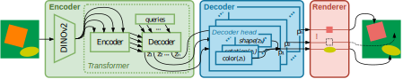

# Generative Learning of Differentiable Object Models for Compositional Interpretation of Complex Scenes

**Accepted at the [NeurIPS 2025 Workshop on SPACE in Vision, Language, and Embodied AI (SpaVLE)](https://space-in-vision-language-embodied-ai.github.io/)**

This repository contains the official implementation of the DVP+ method and the MDS-HR benchmark dataset introduced in the paper _Generative Learning of Differentiable Object Models for Compositional Interpretation of Complex Scenes_. The preprint is available at: [https://arxiv.org/abs/2506.08191](https://arxiv.org/abs/2506.08191).

<div align="center">
  
  <br>
  <em>Figure 1: <strong>Overview of the DVP+ architecture.</strong> The model disentangles complex scenes into interpretable object-centric representations and reconstructs the input via a differentiable rendering pipeline.</em>
</div>

---

## 💾 Dataset (MDS-HR)

The dataset is hosted directly within this repository using Git LFS. Alternatively, if you wish to generate the dataset from scratch, you can execute the `notebooks/dataset_generator.ipynb` notebook.

## 🛠️ Installation

We assume python 3.10 is installed.

#### Environment Setup

```sh
python -m venv .venv
source .venv/bin/activate
```

#### Install Dependencies

```sh
# Core Python libraries
pip install fvcore ipykernel tensorboard transformers ipywidgets seaborn shapely opencv-python scikit-learn-extra scikit-image numpy==1.26.4

# PyTorch and xFormers (CUDA 12.1)
pip install torch==2.1.1 torchvision==0.16.1 --index-url https://download.pytorch.org/whl/cu121
pip install xformers==0.0.23 --index-url https://download.pytorch.org/whl/cu121

# PyTorch3D
pip install --no-index --no-cache-dir pytorch3d -f https://dl.fbaipublicfiles.com/pytorch3d/packaging/wheels/py310_cu121_pyt211/download.html

# Local modules
pip install ./torch_earcut/ ./lcmr/ ./lcmr-ext/
```

#### Install Baselines (MONet & LIVE)

```sh
# MONet
cd notebooks
git clone https://github.com/addtt/object-centric-library
mv object-centric-library object_centric_library

# LIVE
pip install svgwrite svgpathtools cssutils numba torch-tools scikit-fmm easydict visdom cairosvg beautifulsoup4
git clone https://github.com/Picsart-AI-Research/LIVE-Layerwise-Image-Vectorization
cp LIVE_runner.sh ./LIVE-Layerwise-Image-Vectorization/LIVE/
cd LIVE-Layerwise-Image-Vectorization/DiffVG
git submodule update --init --recursive
python setup.py install
cd ../..

# Running LIVE
cd LIVE-Layerwise-Image-Vectorization/LIVE
./LIVE_runner.sh
```

## 🚀 Usage

#### Model Training
Training notebooks for each specific DVP+ configuration can be found in the `notebooks/` directory.

#### Experiments & Evaluation

To reproduce the experiments and results reported in the paper uoy can execute `notebooks/test.ipynb` notebook.

## 🖊️ Citation

If you find this code or dataset useful for your research, please cite our paper:

```
@inproceedings{
  nowinowski2025generativelearningdifferentiableobject,
  title={Self-Augmented Learning of Differentiable Object Models for Compositional Interpretation of Complex Scenes},
  author={Antoni Nowinowski and Krzysztof Krawiec},
  booktitle={NeurIPS 2025 Workshop on Space in Vision, Language, and Embodied AI},
  year={2025},
  url={https://arxiv.org/abs/2506.08191}
}
```
